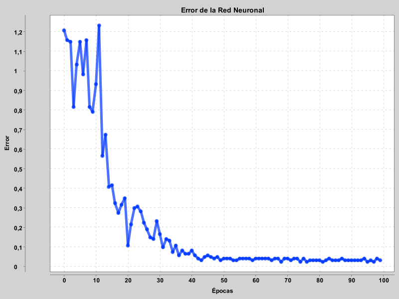
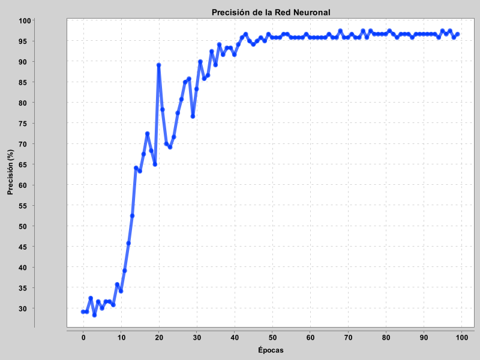

# Red Neuronal

Proyecto hecho para la tarea 1 del ramo _Redes Neuronales y Programación Genética_. El proyecto lee un archivo con los datos del [Iris Dataset](http://archive.ics.uci.edu/ml/datasets/Iris), con los entrena una red neuronal por 100 épocas. Después, muestra los gráficos de su precisión y error dependiendo de la época, y muestra en la consola los datos para crear la matriz de confusión.

## Compilación

El proyecto está configurado para compilarse con Gradle, por lo que es necesario mantenerlo instalado para que corra. Las instrucciones para eso se pueden encontrar [acá](https://gradle.org/install/).

Luego, en esta misma carpeta, el proyecto se puede compilar con

```
gradle build
```

Y se puede correr la clase principal con

```
gradle run
```

## Análisis

### Implementación y dificultades

La red se implementó utilizando programación orientada a objetos. Esto tiene ciertas ventajas para la implementación, porque permite diferenciar más fácilmente la jerarquía de los elementos que componen la red neuronal: la red neuronal en sí, sus capas y sus neuronas.

Lo más difícil de la implementación fue implementar las capas, porque en un principio no tenía claro que debía incluir referencias a la capa anterior y siguiente, y es la clase en la que hay más valores que pueden ser _null_, para lo que resutó útil la _null safety_ de Kotlin.

Extender el perceptron que se había implementado las primeras cátedras por uno que fuera "compatible" con el diseño de la red también fue complicado, porque el diseño inicial no tenía contemplado nada más que calcular una salida, ajustar las propiedades y retornar un resultado. Para la implementación final hubo que agregar las propiedades _delta_ y _error_, necesarias para la propagación de errores en la red.

### Eficiencia

Para el dataset que se ocupó la red no se demora mucho en entrenarse y correr. Sin embargo, hay que tener en cuenta que este dataset es bastante pequeño: 150 elementos en total, de los cuales se usan 120 para el entrenamiento y, además, la red recibe solo 4 entradas, lo que es bastante pequeño.

Por razones de tiempo no se hicieron mediciones de eficiencia en mayor detalle, sin embargo, debido a la forma en que se implementó la red, se puede suponer que la eficiencia no es muy buena en comparación a una red implementada utilizando matrices, por el _overhead_ en el uso de memoria que supone trabajar con clases, y cuando hay que hacer cambios se hace desde métodos internos de cada objeto, en lugar de utilizar funciones con matrices, que están optimizadas si se utilizan bibliotecas especializadas.

### Resultados

A continuación se muestran los gráficos de error y precisión de la red neuronal. El error se calcula utilizando el error cuadrático medio, mientras que la precisión se calcula contando los casos en los que la red entregó un buen resultado, y dividiéndolos por los casos totales.



Para el gráfico del error, se puede ver que este es bastante alto durante las primeras 10 épocas, luego de las cuales baja rápidamente hasta las 30 épocas. Luego, baja más lento, estabilizándose en un error menor a 0,1 desde las 40 épocas en adelante. Se puede observar que el error va bajando a medida que se entrena la red, por lo que la red se comporta como se esperaría en este caso.



El gráfico de la precisión tiene un comportamiento parecido al del error. Durante las 10 primeras épocas sube y baja, aunque en menor magnitud que el error. Luego, hay un crécimiento rápido desde la época 10 a la 30. Las siguientes 15 épocas muestran un crecimiento más lento, y la precición se estabiliza cerca del 97%.

A continuación se muestra la matriz de confusión que se obtuvo con la red para el dataset Iris:

|                   | Setosa        | Versicolor  | Virginica |
| ----------------- |:-------------:|:-----------:|:---------:|
| **Setosa**        | 13            | 0           | 0         |
| **Versicolor**    | 1             | 7           | 0         |
| **Virginica**     | 0             | 0           | 9         |

En la primera fila se muestran los nombres de los valores predichos, mientras que en la primera columna se muestran los valores reales.

Para formar la matriz se le entregaron a la red el 20% de los datos que no se usaron para entrenarla, y los resultados son buenos: solo hubo un caso en que no se entregó el resultado correcto, se confundió una versicolor con una setosa.